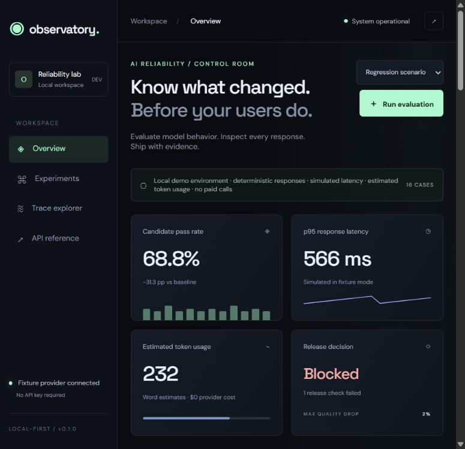
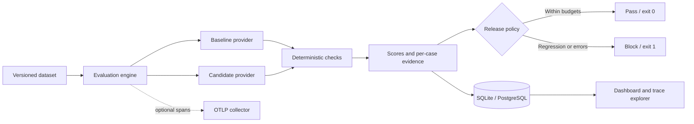

<div align="center">

# LLM Observatory

### Know what changed. Before your users do.

A local-first workspace for LLM evaluation, response tracing, and release decisions.


[](https://github.com/Ramesh-Murala/LLM-Observatory/actions/workflows/quality.yml)

[Quick start](#quick-start) · [How it works](#how-it-works) · [Release gate](#the-release-gate) · [Architecture](docs/architecture.md)

</div>



## Why this exists

A model or prompt change can break a JSON contract, ignore an output constraint, or return a
wrong reference answer while still looking convincing in a few manual tests. Observatory makes
the comparison explicit: run the same cases against a baseline and a candidate, keep the evidence,
and decide whether the change fits your release budget.

The included demo deliberately regresses five cases. The dashboard shows the drop from **100% to
68.75%**, and the CLI blocks the release with a nonzero exit code. No model download, account, or
API key is needed to try that workflow.

## What you can do

| Capability | Implemented behavior |
| --- | --- |
| Paired evaluations | Baseline and candidate run against the same SHA-256-fingerprinted JSONL dataset |
| Deterministic checks | Reference match, phrase inclusion/exclusion, word limits, and JSON field types |
| Trace inspection | Prompt, response, check reasons, provider errors, trace ID, and span ID per case |
| Experiment history | Persistent runs with category comparisons and failed-case filtering |
| Release gate | Blocks quality drops, p95 latency increases, and candidate provider errors |
| Provider boundary | Free fixtures and an opt-in chat-completions-compatible HTTP adapter |
| Usage and cost | Labelled word estimates for fixtures; provider usage and user-configured cost estimates remotely |
| Observability | Optional OTLP HTTP span export and Prometheus-format retained-run metrics |
| Persistence | SQLite by default; PostgreSQL configuration in Docker Compose |
| CI evidence | Tests, lint, a passing scenario, a known blocked scenario, and uploaded JSON reports |

## Quick start

Requires Python 3.11 or newer. Run these commands from the repository root.

```sh
python -m venv .venv
```

Activate the environment:

```sh
# macOS / Linux
source .venv/bin/activate
```

```powershell
# Windows PowerShell
.venv\Scripts\Activate.ps1
```

Install and start:

```sh
pip install -c constraints.txt -e '.[dev]'
observatory seed --scenario regression
uvicorn observatory.api:app --host 127.0.0.1 --port 8000
```

Open **http://127.0.0.1:8000**. Interactive API documentation lives at `/docs`.
The seed command is optional; without it the dashboard starts with an empty history.

### A two-minute walkthrough

1. Open the seeded regression experiment. Notice the blocked decision and category scores.
2. Select **Failed cases only**, then open `json-03`: its response returns a string where an integer is required.
3. Select **Stable scenario** and click **Run evaluation**. The candidate now passes all contracts.
4. Click an older experiment to revisit its evidence. Refresh the page to verify persistence.

## How it works



The engine treats a case as passing only when **every check passes**. A provider exception fails
the case and becomes evidence; the error message itself is not persisted. The dataset contains
16 focused fixture cases in four categories. Its content hash is recorded in every report.

Fixture responses are predefined. Fixture latency is simulated and token usage is a word-count
estimate. The pipeline and scoring run for real, but those fixtures do not measure a real model.

## The release gate

The default policy allows a quality drop of **2 percentage points** and a p95 latency ratio of
**1.5×**. Any candidate provider error blocks the gate. Threshold equality passes.

```sh
# Expected exit code: 0
observatory gate --scenario stable --output reports/stable.json

# Expected exit code: 1 — five deliberately regressed cases
observatory gate --scenario regression --output reports/regression.json

# Configure your release budget
observatory gate --scenario stable --max-quality-drop 0.01 --max-latency-ratio 1.25
```

Exit code `2` means the experiment or report could not be completed. `seed` stores an experiment
for the dashboard and returns `0` when storage succeeds, even if its release decision is blocked.

The included GitHub workflow validates the fixture pipeline on pushes and pull requests. It does
**not** silently call a paid model or establish the quality of a deployed service. Connect your
provider and representative dataset explicitly before treating this as a model release check.

## Bring your own provider

The browser runs fixtures only. Remote evaluations require an explicit CLI flag and environment
variables. See [provider configuration](docs/providers.md) for both shell formats and pricing.

```sh
observatory gate --provider compatible --scenario regression --dataset your-cases.jsonl
```

For a remote run, `regression` means compare the configured baseline and candidate models; it
does not inject failures. Actual latency is measured. API calls may incur provider charges.
Use `observatory seed` with the same options to save remote evidence for inspection in the UI.

## Run with PostgreSQL

```sh
docker compose up --build
```

Open the same local URL and run an evaluation from the dashboard. The API writes to PostgreSQL
and the named volume preserves its data. Compose uses local development credentials. Docker and
PostgreSQL deployment have not been exercised in the current build environment; SQLite is the
verified path. [Architecture notes](docs/architecture.md) explain the persistence tradeoffs.

## Repository map

```text
observatory/
  api.py              HTTP routes and application lifecycle
  engine.py           Paired experiments, summaries, and release policy
  evaluators.py       Deterministic response contracts
  providers.py        Fixture and compatible HTTP adapters
  store.py            SQLAlchemy persistence
  telemetry.py        Optional OTLP export
  cli.py              Seed and CI gate commands
  data/               Versioned JSONL cases
  static/             Dashboard; no frontend build step
tests/                Scoring, failure handling, provider, and persistence checks
docs/                 Architecture, provider setup, screenshots, and demo guide
.github/              Quality workflow and contribution templates
```

## Validation

```sh
ruff check .
pytest -q
```

The tests cover JSON type boundaries (including booleans versus integers), inclusive gate
thresholds, deliberately regressed fixtures, provider failures, HTTP response parsing, API
validation, and persistence across application lifecycles. Browser checks exercise both release
decisions, failed-case filtering, trace details, and the mobile layout.

## Scope and next steps

This is a working local evaluation workbench. The small dataset is suitable for demonstrating
the workflow, not for statistical claims about model quality. Phrase checks are specific response
contracts, not general safety classification. JSON checks validate required top-level field
types; they do not implement full JSON Schema validation. p95 uses nearest rank, with no
confidence interval or repeated-sampling correction.

There is no authentication, request queue, distributed worker, or automatic production traffic
capture. Runs execute synchronously; history and metrics retain the latest 100 runs. Prompt and
response bodies are stored locally. Read [SECURITY.md](SECURITY.md) before using private inputs.
Cost estimates require your own pricing and are not a billing statement or a cost gate.

The next useful additions are repeated trials with uncertainty estimates, human review labels,
JSON Schema support, migrations, and background execution for larger datasets. LLM-as-judge
scoring would need its own calibration dataset before it could be trusted as a release gate.

## Design decisions

- **SQLite for the first run:** a useful demo should not depend on a database service.
- **Deterministic scoring first:** failures should be reproducible and explainable.
- **One origin for UI and API:** fewer moving parts, no frontend build step or CORS configuration.
- **Explicit provider opt-in:** trying the repository should not create an API bill.
- **Evidence with provenance:** dataset hashes, model names, source labels, and policy thresholds travel with the report.

MIT licensed. Contributions are welcome; see [CONTRIBUTING.md](CONTRIBUTING.md).
