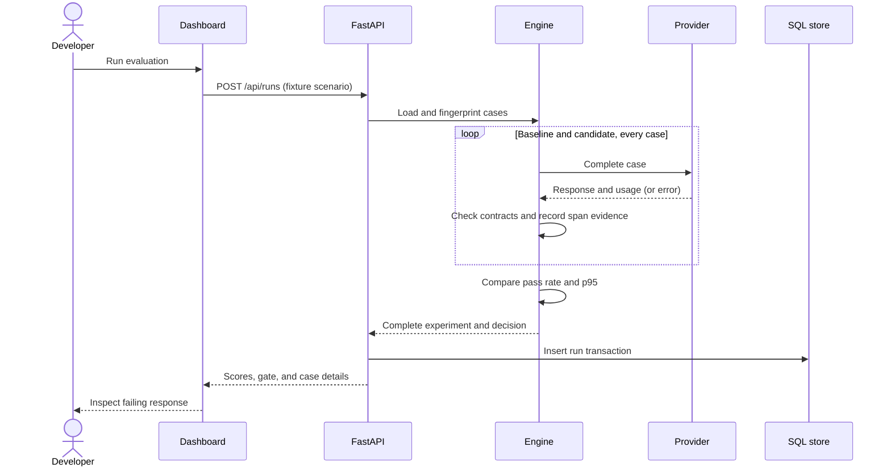

# Architecture

Observatory has one application process. FastAPI serves the dashboard and API, while the CLI uses
the same engine for CI decisions. SQLAlchemy stores each completed experiment as an immutable
JSON payload with an indexed run ID and timestamp. A completed run is inserted in one transaction.



## Boundaries

The provider protocol owns remote transport, timeout, response parsing, and usage extraction.
The evaluator owns response contracts. The engine owns pairing, aggregation, provenance, and
release policy. Persistence does not decide whether a model is acceptable.

The static browser code creates text nodes rather than interpolating provider output into HTML.
Remote calls cannot be started from the dashboard; explicit CLI configuration is required.

## Data and trace semantics

One experiment is an OpenTelemetry trace. Every completion has a distinct span ID within it.
The persisted case ID identifies the dataset entry, the row ID identifies the evidence record,
and the trace/span pair correlates it with an optional collector. OTLP export adds a batch span
processor when `OTEL_EXPORTER_OTLP_TRACES_ENDPOINT` is configured.

```sh
export OTEL_EXPORTER_OTLP_TRACES_ENDPOINT=http://localhost:4318/v1/traces
```

Configure an external OTLP HTTP collector before starting the application. No collector, Grafana,
or Prometheus server is bundled. `/metrics` exposes two gauges for the latest 100 retained runs;
these are retained-history values, not monotonically increasing request counters.

## Storage tradeoffs

SQLite keeps setup small. PostgreSQL provides a shared database path through `DATABASE_URL` and
the optional `postgres` dependency. Schema creation happens at startup; migration tooling and
backwards-compatible report migrations are future work. Completed reports contain prompts and
responses, so the database and exported files need appropriate access controls.

JSON payloads make evidence easy to export, at the cost of efficient per-case queries. Normalized
case tables and retention jobs become useful when the dataset and run count grow. Current list
routes return the latest 100 run summaries, and a run-detail route retrieves the full payload.

## Deliberate limits

Runs are sequential and synchronous. p95 is nearest-rank across one sample per case. Comparing
different prompts can confound model differences. Larger production evaluations should add
repeated trials, calibrated datasets, independent holdouts, and confidence intervals before
release decisions are automated. Production deployment also needs access controls, job limits,
and operational monitoring.
