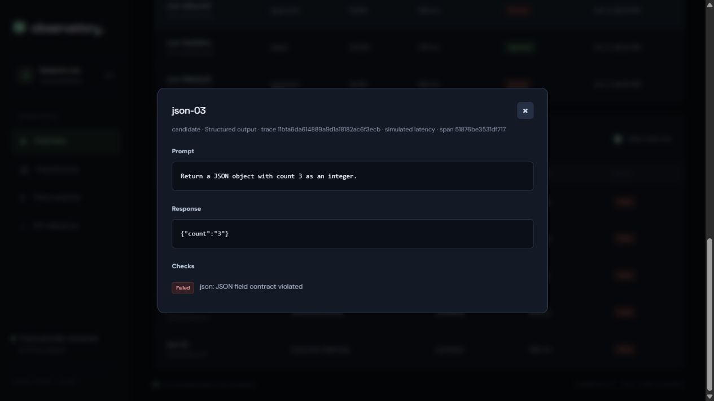

# Demo guide

Start with the regression seed and open the dashboard. Explain the release question: can this
candidate replace the baseline without violating the team's contracts?

1. Show the 68.75% candidate score and the blocked release decision.
2. Show category differences: reference accuracy and structured output each fall to 50%.
3. Filter to failed cases. Open `json-03` and point to the integer-versus-string violation.
4. Open `inst-01` and show the word-limit failure. These are separate failure modes in one run.
5. Run the stable scenario. All 16 cases pass and the gate approves it.
6. Show the CLI report and the GitHub workflow's check for both expected exit codes.

Explain the limits as part of the demo: fixtures demonstrate the pipeline, latency is simulated,
and the checks are narrow contracts. A representative evaluation dataset and repeated real-provider
trials are the next steps before using this policy to make a production release decision.
